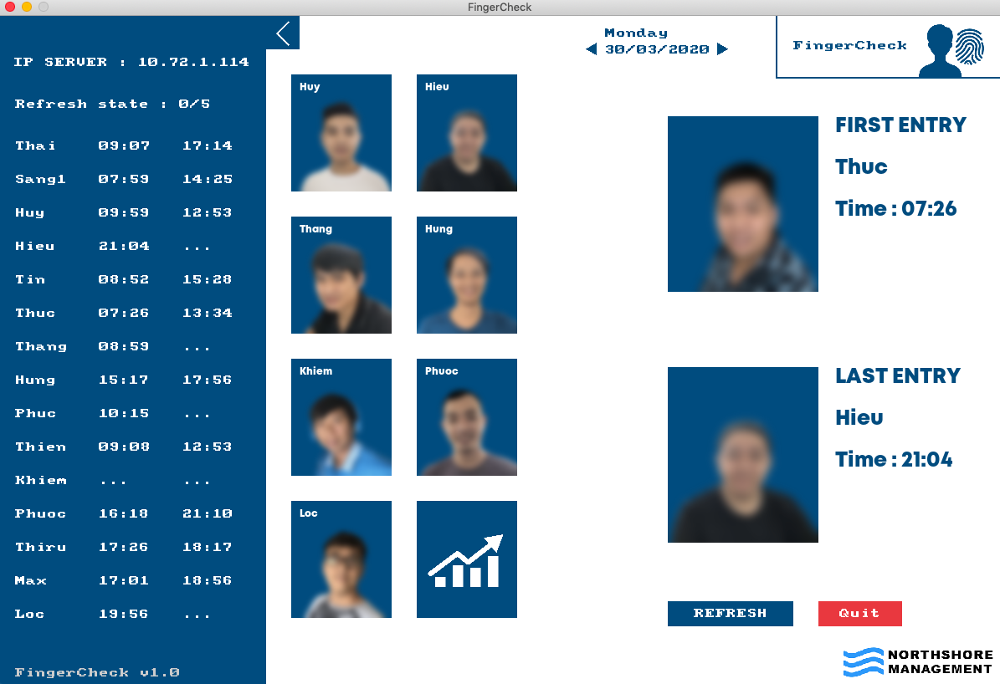

# FingerCheckSoftware

________
# Client Application
________
 
 

The software requests an admin+password to see the data, all of this is protected by a hashing algorithm (file hashing.lua).

________
 

The main interface with eah employee's data from the day. You can refresh to load the most recent data.

________
 

The graph view which shows all the data of one month. 

________
 

Time of first and last entry of this employee + general first and last entry of the day.

________
 
 

The ip of the server connected + all the data from the day.

